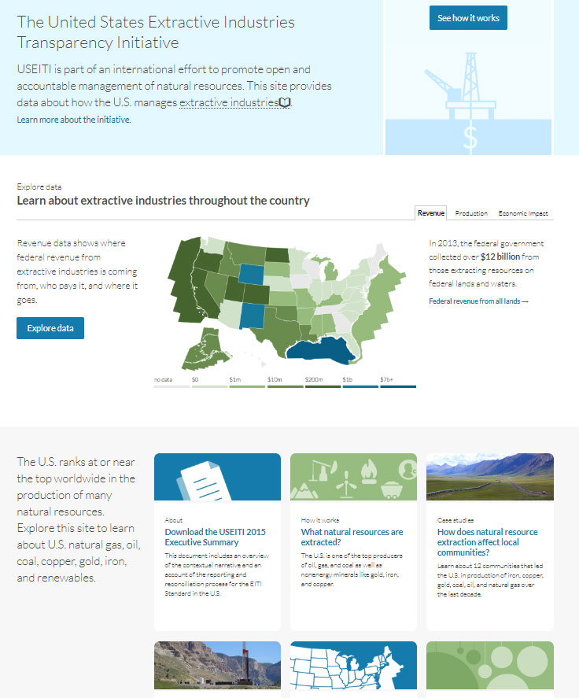

_This is part one of a two-part series about our homepage redesign._

Digital teams from [18F](https://18f.gsa.gov/) and the [Department of the Interior](https://www.doi.gov/) have been publishing government data about energy and mineral extraction on federal lands and waters since 2014 ([Natural Resources Revenue Data](https://revenuedata.doi.gov/ )). Back then, 18F built the site to support the federal government's participation in the [Extractive Industries Transparency Initiative](https://eiti.org/) (EITI). While the U.S. government decided to no longer formally implement the EITI Standard in November 2017, the department remains a strong supporter of the principles of transparency represented by the initiative.

Our small digital team at the [Office of Natural Resources Revenue](https://www.onrr.gov/) continues the work of user-centered and open-data design started by 18F.

## An interactive annual report

Conceived as an interactive version of the USEITI annual report, the scope of the original site included data and information about the overall role of extractive industries in the U.S., not just on federal lands and waters. The site's homepage design treated data and contextual narrative as hierarchical equals in the layout, with a prominent data map preceded and followed by narrative context.

We knew we'd need to narrow the scope of the site content, as we had limited resources relative to the EITI era. We also wanted to reevaluate user needs, focus on datasets that only our organization could provide, and make sure we could validate the data.

Before working on the homepage, we rewrote our product vision to help guide our work:

> We are informing policy debates and raising public awareness by building the definitive source of timely and useful data about how the government manages federal energy and mineral resources, revenue and disbursements.

With this vision guiding our priorities, we set up interviews with active and potential users to test our assumptions and discover their needs.

## User research

[Some of argued that homepages aren't that important](https://theblog.adobe.com/ux-mythbusting-is-the-homepage-really-the-most-important-part-of-your-website/), or at least not as important as they used to be. The increased use of search and social media to convey users deeper into websites is evident, but most users we talked to still use our homepage as their primary starting point.

<!-- Shannon, do you want to write our your process and outcomes here?-->