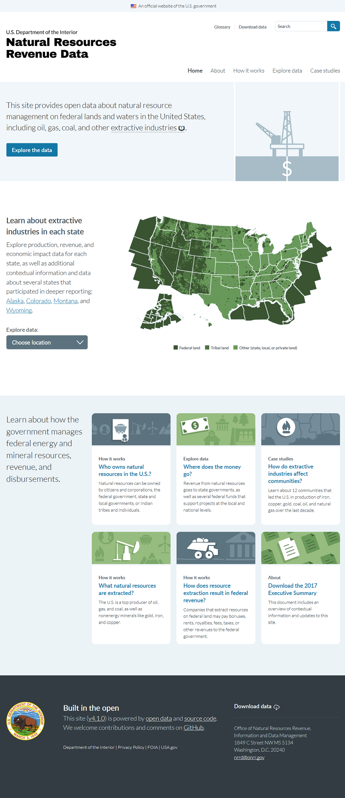
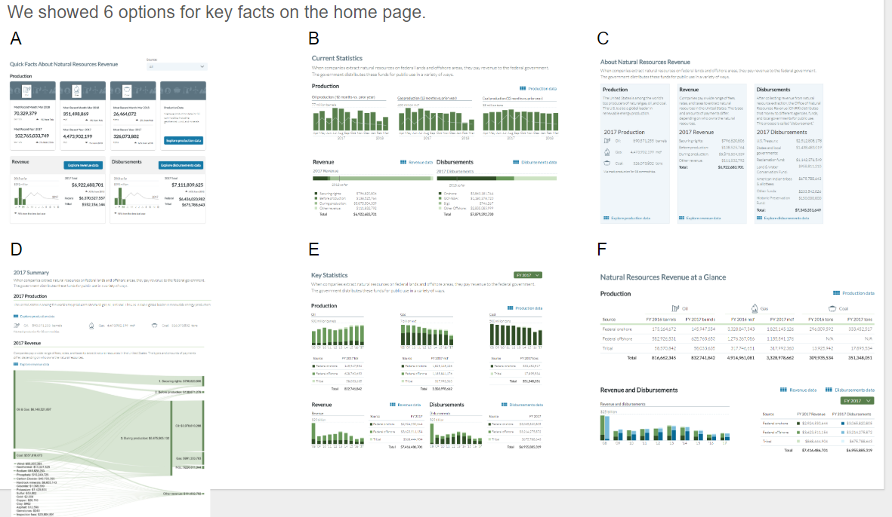
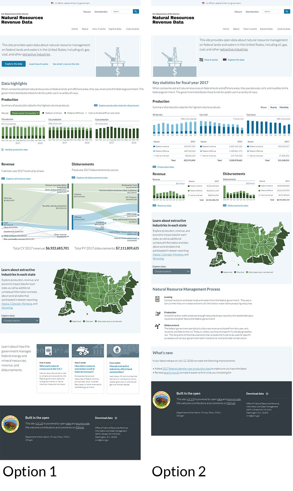
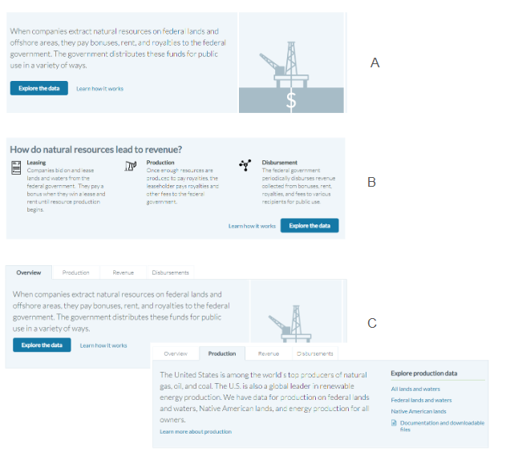

_This is part one of a two-part series about our homepage redesign._

Digital teams from [18F](https://18f.gsa.gov/) and the [Department of the Interior](https://www.doi.gov/) have been publishing government data about energy and mineral extraction on federal lands and waters since 2014. The [Natural Resources Revenue Data](https://revenuedata.doi.gov/) portal provides that open government data today.

Back in 2014, 18F built the site to support the federal government's participation in the [Extractive Industries Transparency Initiative](https://eiti.org/) (EITI). While the U.S. government decided to no longer formally implement the EITI Standard in November 2017, the department remains a strong supporter of the principles of transparency represented by the initiative.

Our small digital team at the [Office of Natural Resources Revenue](https://www.onrr.gov/) continues the work of user-centered and open-data design started by 18F.

## An interactive annual report

Conceived as an interactive version of the EITI annual report, the scope of the site included data and information about the overall role of extractive industries in the U.S., not just on federal lands and waters. The site's homepage design emphasized contextual information over data presentation, even while offering a strong call to action to explore the data.

We knew we'd need to narrow the scope of the site content, as we have limited resources relative to what we had in the EITI era. We also wanted to reevaluate user needs, focus on datasets that only our organization could provide, and make sure we could validate the data.

Before working on the homepage, we rewrote our product vision to help guide our work:

> We are informing policy debates and raising public awareness by building the definitive source of timely and useful data about how the government manages federal energy and mineral resources, revenue, and disbursements.

With this vision laying the foundation for our strategy, we set up interviews with active and potential users to test our assumptions and discover their needs.

## The role of the homepage

[Some have argued homepages aren't that important](https://theblog.adobe.com/ux-mythbusting-is-the-homepage-really-the-most-important-part-of-your-website/), or at least not as important as they used to be. The increased use of search and social media to convey users deeper into websites is evident, but most users we talked to still use our homepage as their primary starting point. Our analytics show it's the most visited page on our site, with 22% of site sessions in 2018.

## User research

Equipped with the knowledge that our homepage was valuable to our users, we set about prototyping and testing options with users. Our goal was to determine how our homepage could better serve the needs of users, whom we had segmented into four main user types:

- [Question answerer](https://github.com/ONRR/doi-extractives-data/blob/research/research/00_UserTypes/00_UserTypes.md#user-type-1-question-answerer)
- [Agenda supporter](https://github.com/ONRR/doi-extractives-data/blob/research/research/00_UserTypes/00_UserTypes.md#user-type-2-agenda-supporter)
- [Storyteller](https://github.com/ONRR/doi-extractives-data/blob/research/research/00_UserTypes/00_UserTypes.md#user-type-3-storyteller)
- [Domain learner](https://github.com/ONRR/doi-extractives-data/blob/research/research/00_UserTypes/00_UserTypes.md#user-type-4-domain-learner)

### First round

In addition to making our homepage more in line with our new strategy, we were getting requests from users who fall into our "domain learner" user type. They were saying they wanted summarized numbers on the homepage so they wouldn't have to dig through the [Explore Data](https://revenuedata.doi.gov/explore/) page to find them. Because of this, we started by testing designs for this on the existing home page. We [tested 6 options](https://github.com/ONRR/doi-extractives-data/blob/research/research/20_fledglingfox/Results.md) with users matching a variety of user types. We landed on a couple options to test in the second round.

### Second round

In the [second round of testing](https://github.com/ONRR/doi-extractives-data/blob/research/research/21_obliviousorangutan/Results.md), we wanted to include new users to make sure our additions didn't scare them away because it assumed prior understanding of the data. We also hadn't done extensive testing on the existing homepage with new users. In addition, we tested with more domain learners to make sure we were meeting their needs. We learned that we needed to better explain the process on the homepage and Explore Data page and landed on the best approach for the new summary information.

### Third round

We then [tested 3 concepts](https://github.com/ONRR/doi-extractives-data/blob/research/research/22_QuietQuail/Results.md) with new users for new content at the top of the homepage that explains the process and how the different pieces of data work together. We landed on one concept that worked best and also learned that general-public users are most likely to use the site to explore data related to their geographic area, so the map needed to come before the new summary information on the home page.

### Final design

These 3 studies led us to the design we ended up with. It better explains the process and brings boiled-up facts to domain learners.  We will also be making changes to summarize data on the Explore Data page and split up that page to make it easier for both audiences to understand the structure of the site and how the data works based on the findings from these studies.

